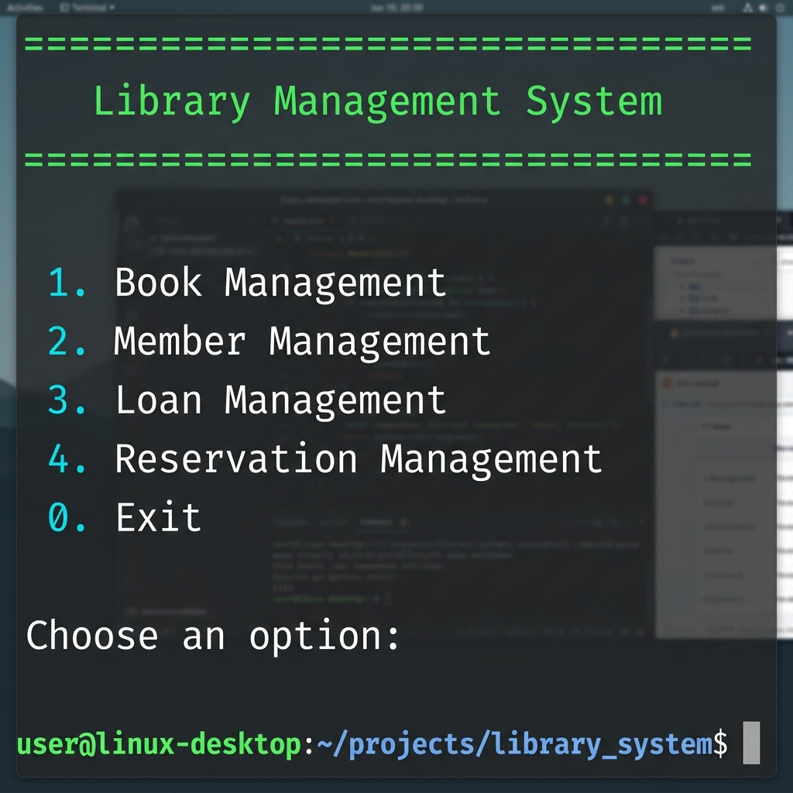
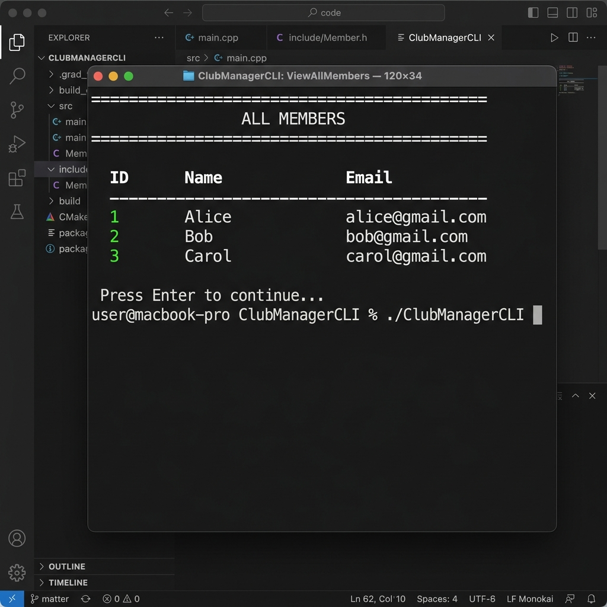
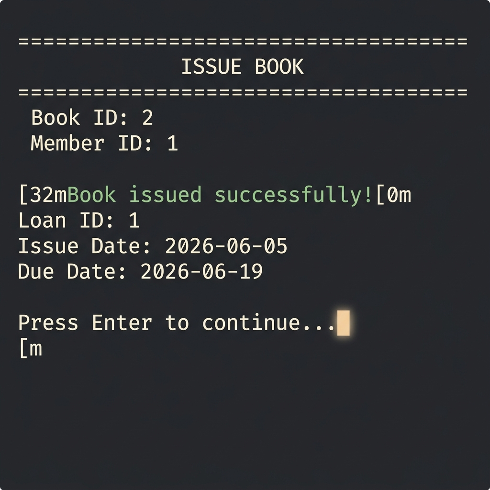
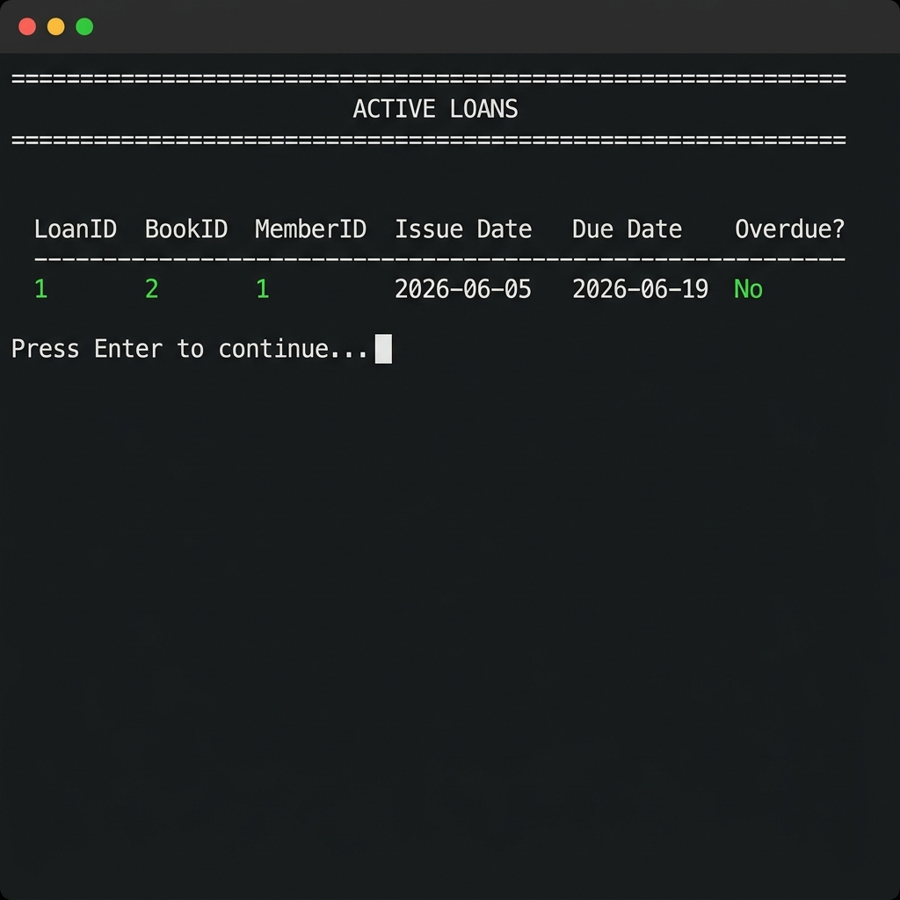
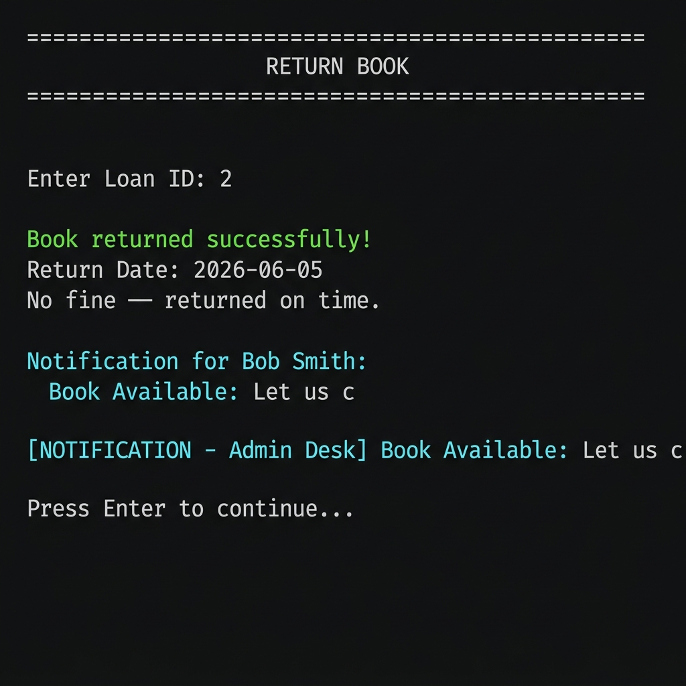
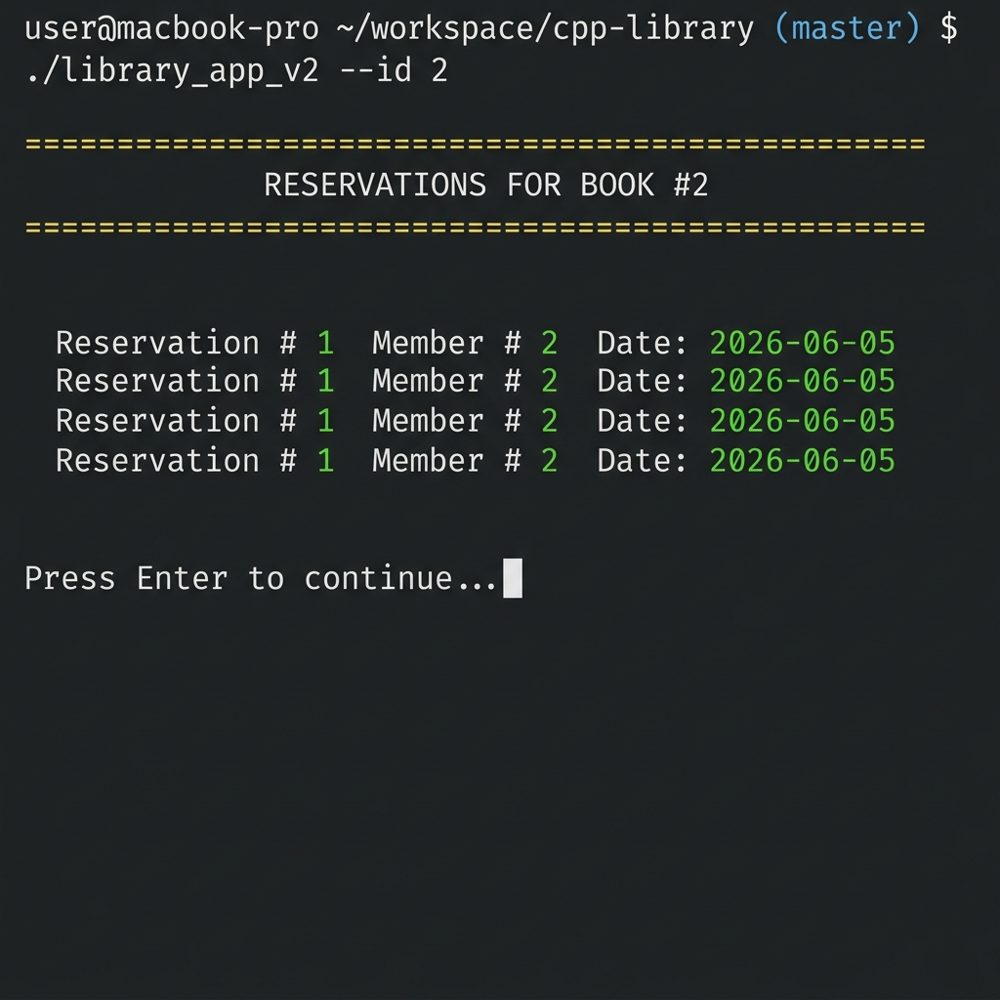
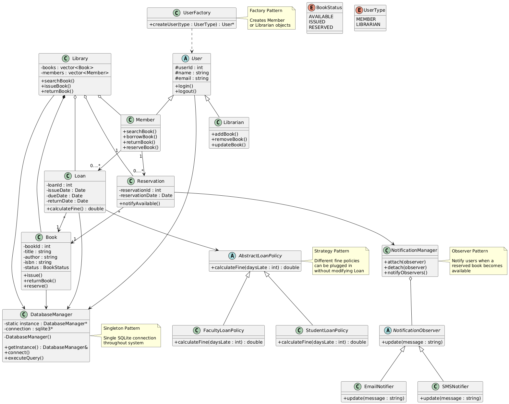
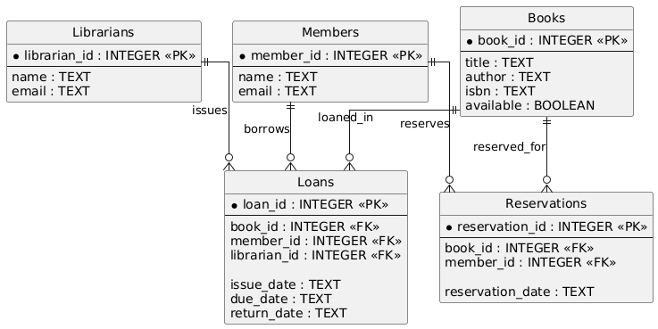
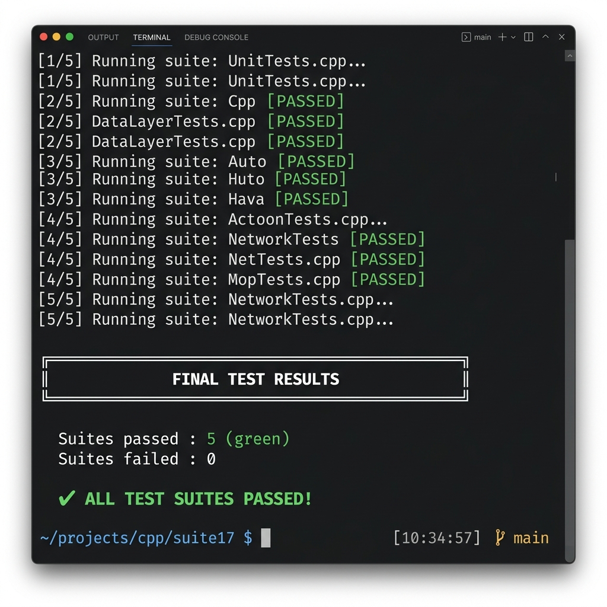

# Library Management System (C++ + SQLite3)

A professional console-based **Library Management System (LMS)** built in C++17, structured according to Object-Oriented Design (OOD) and Low-Level Design (LLD) principles. It implements four GoF Design Patterns (Singleton, Factory, Strategy, and Observer) and uses a persistent **SQLite3** database.

---

## 📸 Screenshots & Design Diagrams

### 1. Main Interface

*Figure 1: The polished console-based Main Menu.*

### 2. Member Management

*Figure 2: Listing all registered members.*

### 3. Loan & Fine Management

*Figure 3: Issuing a book to a member.*


*Figure 4: Tracking active loans.*


*Figure 5: Returning a book with live observer notifications.*

### 4. Reservation System

*Figure 6: Viewing active book reservations.*

### 5. UML Class Diagram

*Figure 7: Object-Oriented structure and relationship design.*

### 6. Database ER Diagram

*Figure 8: Relational schema representation in SQLite.*

### 7. Test Suite Execution

*Figure 9: Automated script verification results (5/5 suites passing).*

---

## 🛠 Tech Stack

| Tool | Version / Purpose |
|---|---|
| **C++17** | Modern object-oriented features, clean structures |
| **SQLite3** | Lightweight persistent database |
| **CMake 3.16+** | Cross-platform build system |
| **Bash** | Automated test suites and runner scripts |

---

## 📂 Project Structure

```text
LMS/
├── CMakeLists.txt              ← Build configuration
├── README.md                   ← Project documentation
├── .gitignore                  ← Version control ignore files
│
├── database/
│   ├── schema.sql              ← Database table definitions
│   └── seed.sql                ← Sample books, members, and reservations data
│
├── images/                     ← Console screenshots, UML, and ER diagrams
│
├── src/
│   ├── main.cpp                ← CLI shell program entry point
│   │
│   ├── core/
│   │   ├── Library.h / Library.cpp   ← Central business logic orchestrator
│   │
│   ├── models/                 ← Domain objects
│   │   ├── User.h / User.cpp
│   │   ├── Member.h / Member.cpp
│   │   ├── Librarian.h / Librarian.cpp
│   │   ├── Book.h / Book.cpp
│   │   ├── Loan.h / Loan.cpp
│   │   ├── Reservation.h / Reservation.cpp
│   │   └── UserType.h
│   │
│   ├── factories/              ← Factory Pattern
│   │   ├── BookFactory.h / BookFactory.cpp
│   │   └── UserFactory.h / UserFactory.cpp
│   │
│   ├── strategies/             ← Strategy Pattern
│   │   ├── IFineStrategy.h
│   │   ├── DailyFineStrategy.h / DailyFineStrategy.cpp
│   │   └── FlatFineStrategy.h / FlatFineStrategy.cpp
│   │
│   ├── observers/              ← Observer Pattern
│   │   ├── IObserver.h
│   │   ├── ISubject.h
│   │   └── NotificationObserver.h / NotificationObserver.cpp
│   │
│   ├── database/               ← Database connection wrapper
│   │   ├── DatabaseManager.h
│   │   └── DatabaseManager.cpp
│   │
│   └── utils/                  ← Date operations & logging utilities
│       ├── Constants.h
│       ├── Logger.h
│       └── DateUtils.h / DateUtils.cpp
│
└── tests/                      ← Test suites
    ├── run_all_tests.sh        ← Master automated runner
    ├── run_interactive.sh      ← Interactive CLI setup & launcher
    ├── manual_test_guide.md    ← Manual CLI verification checklist
    ├── test_books.sh
    ├── test_members.sh
    ├── test_loans.sh
    ├── test_reservations.sh
    └── test_patterns.sh
```

---

## 🎨 Design Patterns Implemented

The architecture conforms to SOLID principles and patterns:

1. **Singleton Pattern (`src/database/DatabaseManager`)**
   * Ensures that exactly one instance of the database connection wrapper is initialized and shared across the application.
   * Controls connection creation and cleanup safely.

2. **Factory Pattern (`src/factories/BookFactory`, `UserFactory`)**
   * Decouples object creation from application code.
   * Validates data structure attributes (e.g., checks if ISBN is exactly 13 digits) before object creation and SQLite insertion.

3. **Strategy Pattern (`src/strategies/DailyFineStrategy`, `FlatFineStrategy`)**
   * Encapsulates the fine calculation logic.
   * Supports dynamic selection of calculation policy (`DailyFineStrategy` charging ₹5/day or `FlatFineStrategy` charging a flat ₹50 fee).

4. **Observer Pattern (`src/observers/IObserver`, `ISubject`, `NotificationObserver`, `Member`)**
   * Tracks active book reservations.
   * On returning a reserved book, the system instantiates the member observers and the admin observer, attaches them to the `Book` subject, and triggers real-time console notification events about the book's availability.

---

## ⚙️ Build & Installation

### 1. Prerequisites (Linux/Ubuntu)
```bash
sudo apt update
sudo apt install -y build-essential cmake libsqlite3-dev sqlite3
```

### 2. Standard Compilation
```bash
# Clone the repository and navigate inside
cd /path/to/LMS

# Create and enter build folder
mkdir -p build && cd build

# Configure and compile
cmake .. -DCMAKE_BUILD_TYPE=Debug
make -j$(nproc)
```
The compiled binary executable `LMS` is located in `build/`.

---

## 🚀 How to Run

### Interactive Console Mode
We provide a utility script that resets, seeds sample data, compiles, and launches the LMS interactive CLI:
```bash
cd /path/to/LMS
bash tests/run_interactive.sh
```

### Inspect Database Directly
You can open and query the SQLite database file:
```bash
cd build/
sqlite3 library.db
```
Useful SQL queries:
```sql
.headers on
.mode column
SELECT * FROM books;
SELECT * FROM members;
SELECT * FROM loans WHERE return_date IS NULL;
SELECT * FROM reservations;
.quit
```

---

## 🧪 Automated Testing

The LMS includes 5 comprehensive Bash smoke test suites that check domain constraints, business rules, persistence, and design patterns.

### Run All Automated Tests
```bash
cd /path/to/LMS
bash tests/run_all_tests.sh
```

### Run Individual Test Suites
```bash
bash tests/test_books.sh        # Books CRUD & validation check
bash tests/test_members.sh      # Member insertion & duplicate validation
bash tests/test_loans.sh        # Issue, return, double check-out, and fine logic
bash tests/test_reservations.sh # Active reservations and observer triggers
bash tests/test_patterns.sh     # Verify Singleton, Strategy, Factory, Observer
```

---

## 📅 Dynamic Due Date & Fines Simulation

The system sets a default **14-day** loan period. To make testing overdue fees straightforward, a dedicated menu option is provided in the console UI:
* **Option `3` (Loan Management) ➔ `4. Update Loan Due Date`**
* You can select an active loan and change its due date to a past date (e.g., `2026-05-01`).
* When returning that book, the system instantly detects the overdue duration, applies the active strategy (Daily or Flat), and logs the calculated fine.

For a detailed walkthrough, check out the [Manual Test Guide](tests/manual_test_guide.md).
